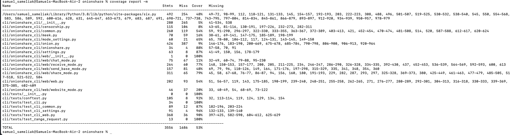
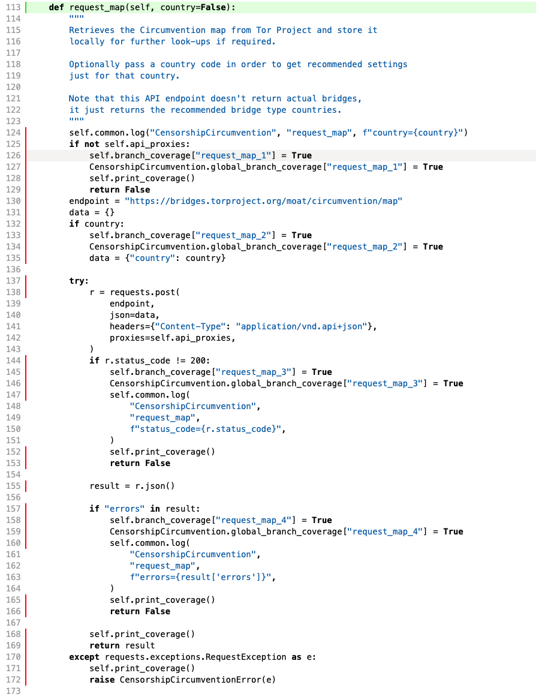
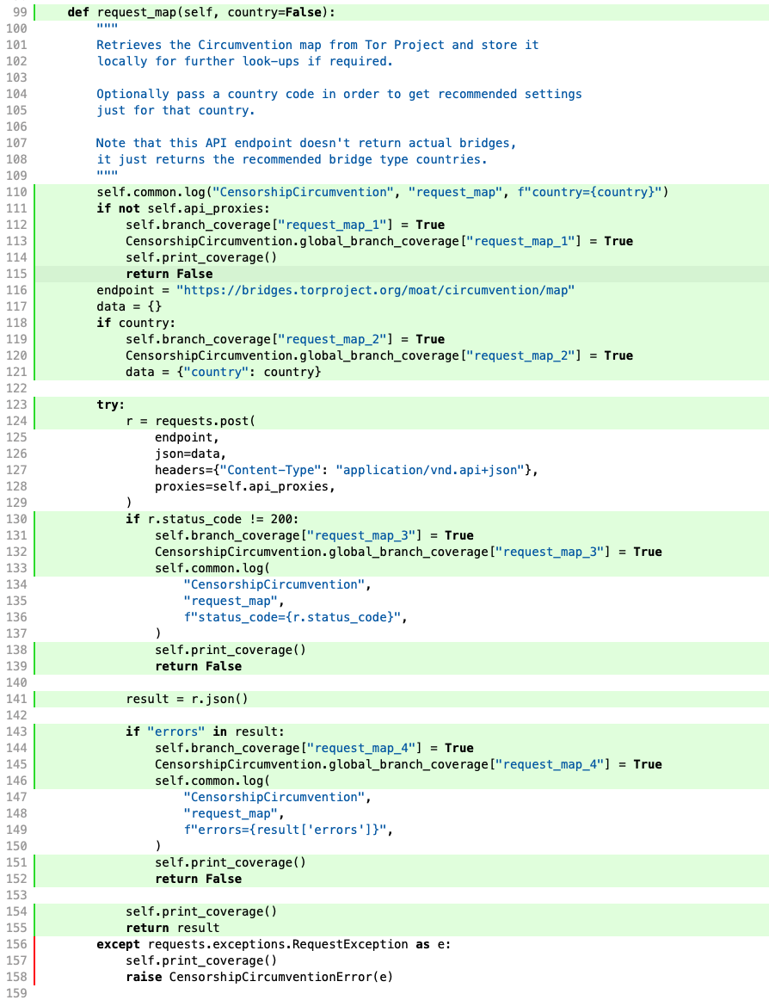
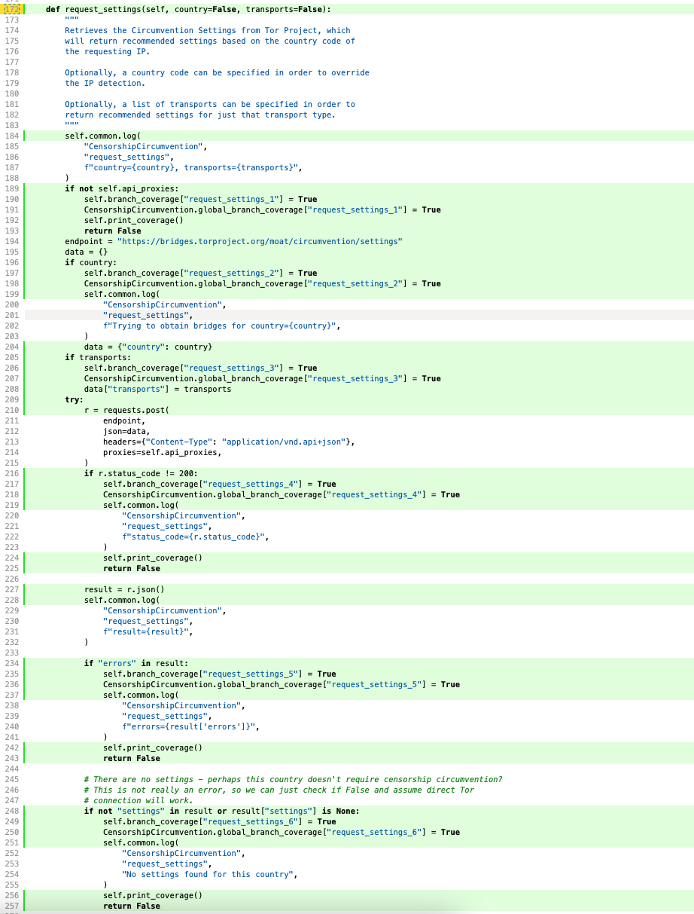
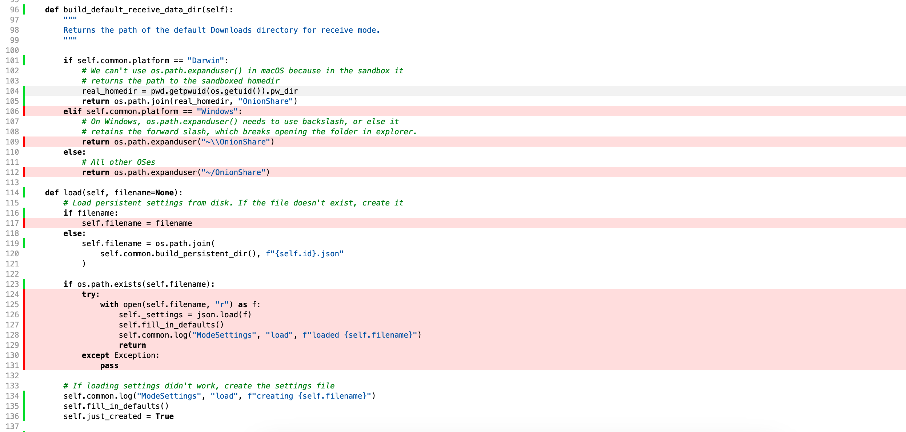
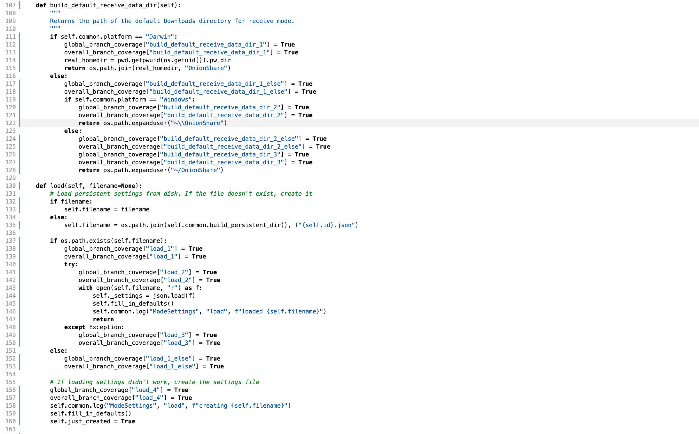
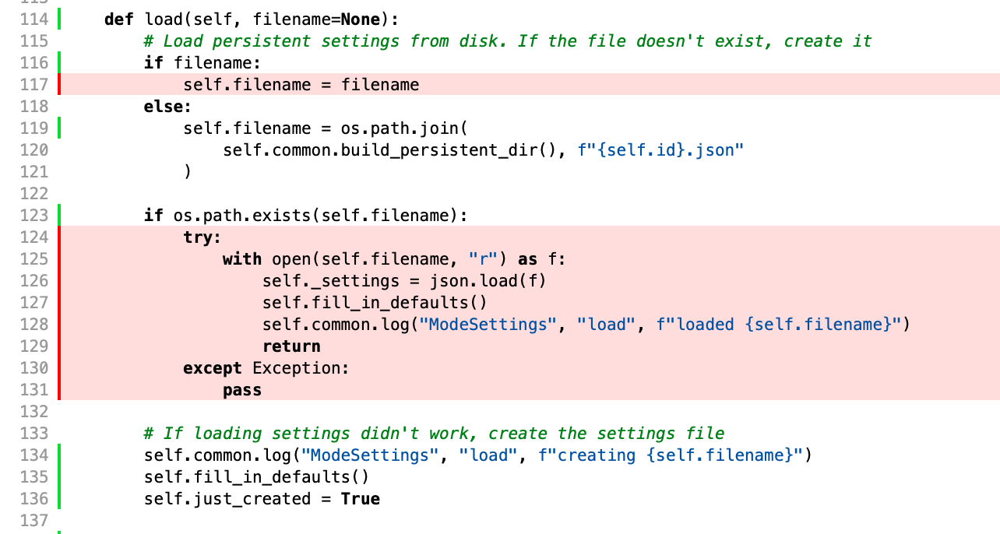
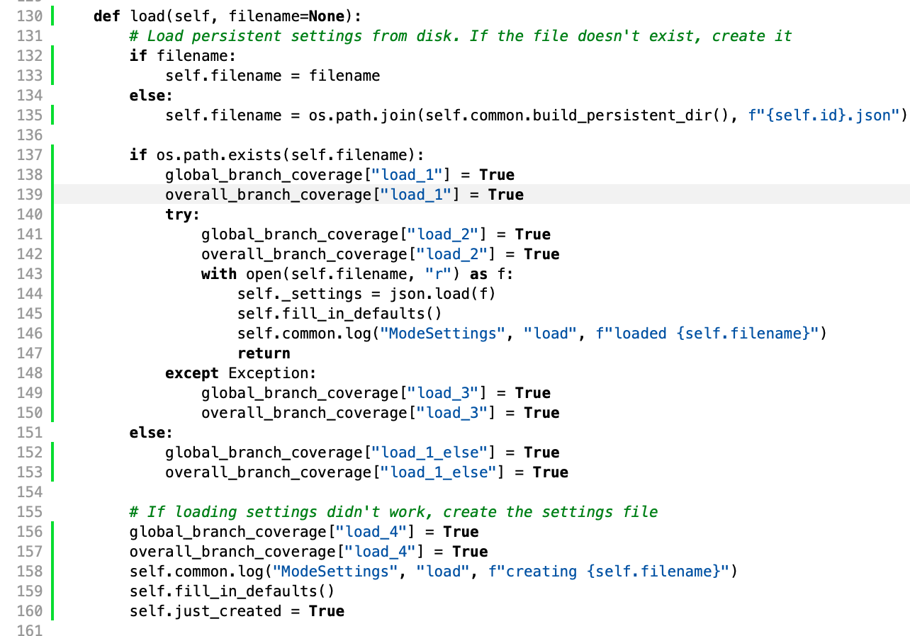
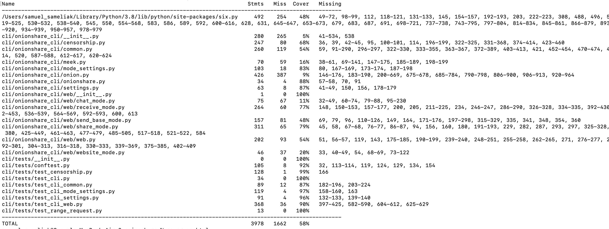

1. Execution of existing coverage measurement tool

2. FUNCTION: request_map
    Original coverage report
    
    New coverage report
    

3. FUNCTION: request_settings
    Original coverage report
    
    New coverage report
    

4. FUNCTION: build_default_receive_data_dir
    Original coverage report
    
    New coverage report
    

5. FUNCTION: load
    Original coverage report
    
    New coverage report
    

6. Final coverage report
    
